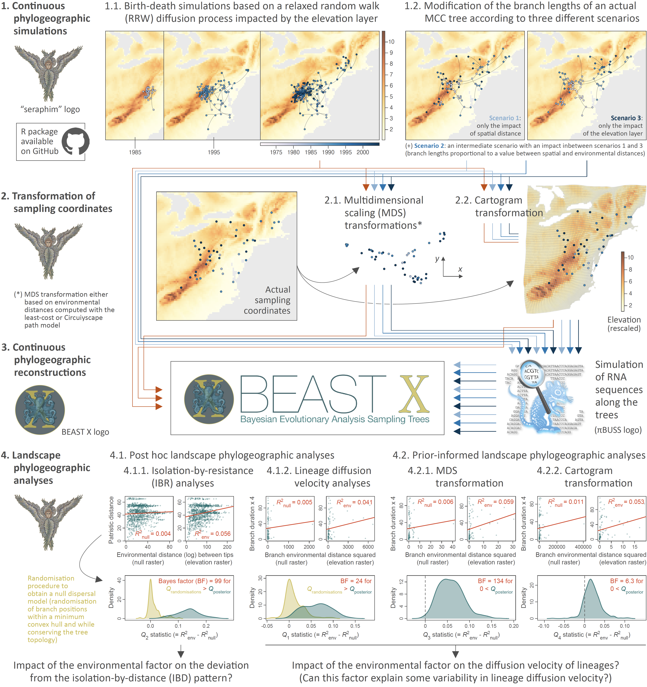

Peaks and valleys of viral landscape phylogeography
===============

This repo gathers the input files and scripts related to our study entitled "**Comparative performance of novel viral landscape phylogeography approaches**" (Dellicour *et al*. *in prep.*). R scripts used to conduct the different analytical steps summarised within the workflow figure just below are all available in `R_scripts_analyses.r`.

The fast rate of evolution in RNA viruses implies that their evolutionary and ecological processes occur on the same time scale. Genome sequences of these pathogens can therefore contain information about the processes that govern their transmission and dispersal. In particular, landscape phylogeographic approaches use phylogeographic reconstructions to investigate the impact of environmental factors and variables on the spatial spread of viruses. Here, we extend and improve existing approaches and develop three novel landscape phylogeographic methods that can test the impact of continuous environmental factors on the diffusion velocity of viral lineages. In order to evaluate the different methods, we also implemented two simulation frameworks to test and compare their statistical performance. The results enable us to formulate clear guidelines for the use of three complementary landscape phylogeographic approaches that have sufficient statistical power and low rates of false positives. Our open-source methods are available to the scientific community and can be used to investigate the drivers of viral spread, with potential benefits for understanding virus epidemiology and designing tailored intervention strategies.

 

**Figure: simulation and analytical workflow implemented to assess the statistical performance of four landscape phylogeographic approaches to test the impact of environmental factors on the diffusion velocity of viral lineages or the deviation from an isolation-by-distance pattern.** We here assessed the performance of two post hoc (isolation-by-resistance and lineage diffusion velocity analyses) and two prior-informed landscape phylogeographic approaches (analyses of continuous phylogeographic reconstructions based on sampling coordinates obtained either after a multidimensional scaling or cartogram transformation). Continuous phylogeographic simulations (step 1), transformations of sampling coordinates (step 2), and landscape phylogeographic analyses were conducted with the R package “[seraphim](https://github.com/sdellicour/seraphim)”, the RNA sequences simulations with the program [πBUSS](https://rega.kuleuven.be/cev/ecv/software/pibuss), and the continuous phylogeographic reconstructions (step 3) with the software package [BEAST X](https://beast.community/) version 1.10.5 (19). (*) Multidimensional scaling (MDS) transformations were conducted based on environmental distances among pair of tip nodes, which were computed using either the least-cost (5) or Circuitscape (3, 32) path model while either considering the environmental raster (here an elevation raster with values rescaled between 0 and 10) or a corresponding “null” raster with accessible raster cell values uniformly equal to “1” (see the text for further detail). “MCC tree” refers to a maximum clade credibility tree.
